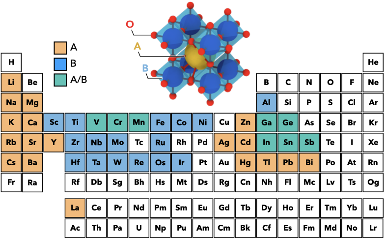

# Cubic-Perovskite-WorkFunction

This repository contains the dataset perovskites' work functions using first principles and the electronic descriptors
 to perform data-driven analysis. This work aims to identify the electronic factors and how they control perovskite 
 oxides' work functions.
 
The following paper describes the details of the analysis:
 
 **Data-driven analysis of the electronic factors controlling the work functions of perovskite oxides**



## Table of Contents
- [Prerequisites](#prerequisites)
- [Usage](#usage)

## Getting Started
### Prerequisites

- [scikit_learn](https://scikit-learn.org/stable/)
- [Numpy](https://numpy.org)
- [pandas](https://pandas.pydata.org)
- [joblib](https://joblib.readthedocs.io/en/latest/)
- [biokit](https://github.com/biokit/biokit)
- [pdpbox](https://github.com/SauceCat/PDPbox)
- [matplotlib](https://matplotlib.org)
- [seaborn](https://seaborn.pydata.org)

biokit is used for plotting correlation matrix, pdpbox is used to perform partial dependence analysis (PDP). The prerequisites
can also be installed using pip.

```bash
pip install -r requirements.txt
```

## Usage

The analysis of the perovskites' work functions contain three main steps, the help messages can be find using:
```bash
python correlated_matrix.py -h
python rfecv.py -h
python model_analysis.py -h
```
The dataset contains the original 38 electronic features and the first principles-derived work functions is in the 
`data` folder, the definition of the features can be found in our manuscript: *Data-driven analysis of the electronic 
factors controlling the work functions of perovskite oxides*

1. remove correlated features, default by enumeration method and dumping the plot:
    ```bash
    python correlated_matrix.py -e -p
    ```
    This step creates new dataset `perovskite_wf_data_uncorr.csv` in `data` directory. 

2. recursive feature elimination with cross-validations, hyperparameters tuned at each step, for example:
    ```bash
    python rfecv.py --term A --rfecv
    ```
    This perform the recursive feature elimination for A-termination of perovskites based on random forest regressor, the
hyperparameter is selected at each step. The optimized features and transformed dataset are saved in `rfecv_results` 
and `data` directory, respectively.

3. Analysis of the model's performance, with partial dependence analysis.
    ```bash
    python model_analysis.py --term A --pdp_1d --pdp_2d
    ```
   --pdp_1d and --pdp_2d flag will perform the partial dependence analysis, available feature names will be displayed.

rfecv and pdp results can be plotted using `plotter.py` in `plot_tools` directory:

```bash
python plotter.py --rfecv --pdp
```
the obtained figures are stored in `rfecv_results` and `results directory`, respectively.

The trained models for AO and BO<sub>2</sub>-terminated interfaces are stored in `model_checkpoints`.